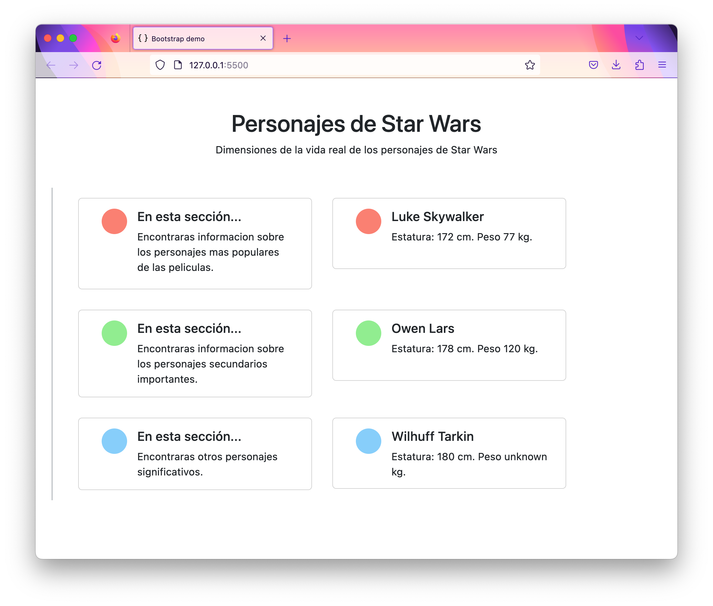

# Prueba de Consolidacion M4 - Consumo de API Star Wars

## Proyecto 🚀

Este proyecto corresponde a la prueba de consolidacion del modulo 4, para el bootcamp **"Desarrollo de Aplicaciones Full Stack JavaScript Trainee V2.0 Vespertino"** provisionado en la plataforma **E-Camp** y se consolida lo aprendido en dicho modulo.

El proyecto consiste en consumir la API gratuita de [Star Wars (SWAPI)](https://swapi.dev/) y generar un sitio web responsivo que muestre la altura y peso de los personajes en tarjetas mediante 'mouseover'.

## Requisitos (checklist) 📋

1. Deberás consumir la API gratuita de Star Wars. ✅
2. Al ingresar al enlace entregado deberás evaluar cual es la ruta correspondiente para poder realizar el ejercicio. ✅
3. Deberás obtener el nombre, Altura y Peso de los personajes. ✅
4. Debera segmentar los llamados por lotes de 5 personajes ✅
5. Desplegar informacion de la API en el front mediante cards. ✅

## Técito Time ☕

En este proyecto los elementos fueron renderizados via etiquetas Template de HTML, cloneNode, fragment y appendChild de JS, para conseguir el efecto deseado. Puede encontrar mas información de estos metodos en Recursos.

## Recursos Utilizados 📌

-   [Bootstrapt 5.3](https://getbootstrap.com/)
-   [AnimatiSS](https://xsgames.co/animatiss/)
-   [SWAPI](https://swapi.dev/)
-   [Template](https://developer.mozilla.org/es/docs/Web/HTML/Element/template)
-   [Fragment](https://developer.mozilla.org/es/docs/Web/API/Document/createDocumentFragment)
-   [cloneNode](https://developer.mozilla.org/es/docs/Web/API/Node/cloneNode)
-   [appendChild](https://developer.mozilla.org/es/docs/Web/API/Node/appendChild)
-   [Guias Bluuweb 👍🏼](https://bluuweb.dev/04-javascript/05-dom.html)

---

⌨️ con ❤️ por [Varayac (Víctor Araya)](https://github.com/varayac) 😊
